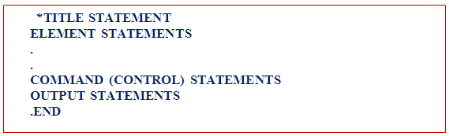
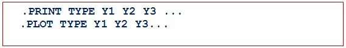
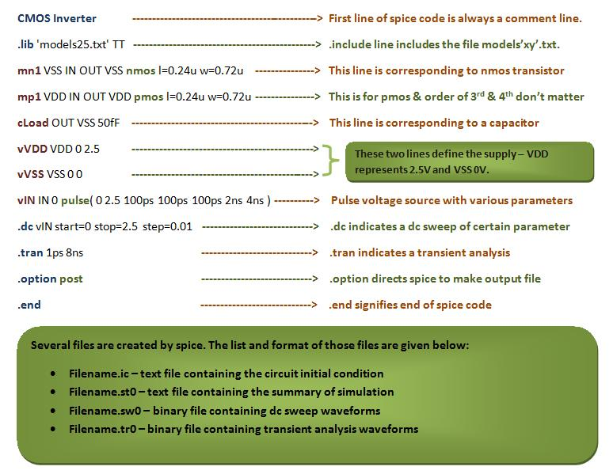

**INTRODUCTION TO SPICE**

SPICE (Simulation Program with Integrated Circuit Emphasis) is a powerful program used in integrated circuit and board-level design to check the integrity of circuit designs and to predict circuit behavior. SPICE was originally developed at the Electronics Research Laboratory of the University of California, Berkeley (1975). Simulating the circuit with SPICE is the industry-standard way to verify circuit operation at the transistor level before manufacturing an integrated circuit. In a SPICE program, circuit elements (transistors, resistors, capacitors, etc.) and their connections are translated into a text netlist.


Several types of circuit analyses can be done using SPICE:

- DC analysis: calculates the DC transfer curve.
- Transient analysis: calculates voltage and current as a function of time when a large signal is applied.
- AC Analysis: calculates output as a function of frequency (Bode plot).
- Noise analysis.
- Sensitivity analysis.
- Distortion analysis.
- Fourier analysis: calculates and plots the frequency spectrum.
- Monte Carlo Analysis.

All analyses can be done at different temperatures. The default temperature is 300K.

A spice input file, also called source file, consists of three parts:

- **Data statements:** These statements are description of the components and their I nterconnections.

- **Control statements:** These statements are responsible to tell SPICE simulator what type of analysis to perform on the circuit.

- **Output statements:** These statements specify what outputs are to be printed or plotted.

Although these statements may appear in any order, it is recommended that they be given in the above sequence. Two other statements are required: the title statement and the end statement. The title statement is the first line and can contain any information, while the end statement is always .END. The title statement must be a line or word. In addition, you can insert comment statements, which must begin with an asterisk (\*) and are ignored by SPICE Simulator.



**1. Data Statements**

(A).Independent DC Sources


N1 is the positive terminal node. N2 is the negative terminal node. Type can be DC, AC or TRAN, depending on the type of analysis. Value gives the value of the source. The name of a voltage and current source must start with V and I, respectively.


The positive current direction through the current or voltage source is from the positive (N1) node to the negative (N2) node:

(B) Elements: for example MOSFETS


The MOS transistor name (Mname) has to start with a M; ND, NG, NS and NB are the node numbers of the Drain, Gate, Source and Bulk terminals, respectively. ModName is the name of the transistor model (NMOS or PMOS). L and W are the length and width of the gate (in m).

2. Commands or Control Statements:

.TRAN Statement

 
  
   This statement specifies the time interval over which the transient analysis takes place, and the time increments. The format is as follows: TSTEP is the printing increment. TSTOP is the final time TSTART is the starting time (if omitted, TSTART is assumed to be zero) TMAX is the maximum step size. UIC stands for Use Initial Conditions. If UIC is specified then simulator will use the initial conditions specified in the element statements.

3.Output Statements



These statements will instruct Simulator what output to generate. If you do not specify an output statement, Simulator will always calculate the DC operating points. The two types of outputs are the prints and plots. A print is a table of data points and a plot is a graphical representation. The format is as follows:

In above format TYPE specifies the type of analysis to be printed or plotted and can be:


The output variables are Y1, Y2 and can be voltage or currents in voltage sources. Node voltages and device currents can be specified as magnitude (M), phase (P), real (R) or imaginary (I) parts by adding the suffix to V or I as follows:

M: Magnitude.

DB: Magnitude in dB (decibels).

P: Phase.

R: Real part.

I: Imaginary part.


Complete example (Inverter-Netlist):


In introduction of this experiment we have seen what is spice actually. In first experiment we have designed inverter, so as we have read in introduction that whenever you place anyting like transistor or capacitor etc., there is a code which is written at back end corresponding to the element placed on screen. So in this experiment we are going to learn what is taht code which is written in the back end, that is, we learn how to write that code directly, that is, we will learn basic inverter designing using spice coding.

The following is the code for inverter in spice along with some of the explaination.



Now we will be learning actually what parameters are specified by each of the element in every line in detail

**FIRST LINE**

First line of spice code is always a comment. So this line is always ignored by spice. Spice does not do any kind of processing on this line.

**INCLUDE LINE**

.include line includes the model file but you should confirm that your model file should be in your current directory in which you are working.

**LINE CORRESPONDING TO TRANSISTOR**
This line defines the MOSFET in the circuit. The general format is:

```
M<name> <Drain> <Gate> <Source> <Bulk> <ModelName> L=<length> W=<width>
```

- **M<name>**: Unique identifier for the MOSFET (e.g., M1).
- **Drain, Gate, Source, Bulk**: Node numbers/names for each terminal.
- **ModelName**: Specifies the transistor type (e.g., NMOS, PMOS).
- **L, W**: Channel length and width (in meters).

**Example:**

```
M1 out in 0 0 NMOS L=180n W=1u
```

This defines an NMOS transistor named M1, with output at node 'out', input at node 'in', source and bulk at ground (0), using the NMOS model, with channel length 180nm and width 1μm.

**COMPLETE INVERTER NETLIST EXPLANATION**

Let's break down a simple inverter netlist:

```
* Inverter circuit
.include 'models.lib'
Vdd vdd 0 1.8
Vin in 0 PULSE(0 1.8 0 1n 1n 10n 20n)
M1 out in 0 0 NMOS L=180n W=1u
M2 out in vdd vdd PMOS L=180n W=2u
.tran 0.1n 50n
.plot tran V(out) V(in)
.end
```

- The first line is a comment.
- `.include` brings in the required transistor models.
- `Vdd` and `Vin` define the supply and input sources.
- `M1` and `M2` are the NMOS and PMOS transistors forming the inverter.
- `.tran` sets up transient analysis.
- `.plot` specifies which voltages to plot.
- `.end` marks the end of the netlist.

**KEY POINTS TO REMEMBER**

- Always start with a comment and include necessary model files.
- Define all sources and transistors with correct node connections.
- Use control statements to specify the type of analysis.
- Output statements help visualize results.
- SPICE netlists are flexible but require careful attention to syntax and node assignments.
