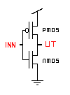

### Steps to Complete the Code

1. **Arrange the Code Blocks:**

   - Place the code block that defines the gate name, includes the model file, and declares parameters first.
   - Next, add the code block that defines the voltage source.
   - Then, add the block that defines the inverter subcircuit.
   - Follow with the netlist statement that instantiates and calls the inverter subcircuit.
   - Add the block that defines the input waveform 'a'.
   - Add the control statements to run the circuit and plot the required graphs.
   - Finally, add the end-of-code block.

2. **Drag and Drop:**

   - Drag and drop the code blocks to arrange them in the order mentioned above.

3. **Complete the Code Blocks:**

   - Enter the name of the MOSFET model file to be included (`PTM_45nm.txt`).
   - For the voltage source, enter a name and select `vdd` as the positive terminal and `0` or `gnd` as the negative terminal.
   - Define the subcircuit by giving it a name and specifying the input and output arguments.
   - Inside the subcircuit block, connect the PMOS and NMOS as follows:
     - `INSTANCE_NAME DRAIN GATE SOURCE BODY NAME_OF_MOSFET_AS_MENTIONED_IN_MODEL_FILE_INCLUDED w=WIDTH l=LENGTH`
     - Give instance names to both NMOS and PMOS.
     - Connect the drain ports of both MOSFETs to the output of the subcircuit, the gates to the input, and the source/body of PMOS to `vdd`, and of NMOS to `gnd` or `0`.
   - Refer to the following circuit diagram for connections:

     

   - End the subcircuit block by typing the name of the subcircuit after `.ends`.
   - Call the inverter subcircuit by giving an instance name, then `a` as input and `out` as output, and complete the call by typing the inverter subcircuit name.

**Note:**

- While naming subcircuits, nodes, variables, and instance names, ensure they begin with an alphabet, `%`, `$`, or `_` and only contain alphanumeric characters, `%`, `$`, and `_`.
- The SPICE code is case-insensitive. Do not use the same name for any two variables in the same circuit or subcircuit, regardless of case.

### Observations

- After clicking the **Validate** button (assuming all code blocks are filled correctly), you should see a "Success" message, a report, and input/output graphs under the Observations section.
- Observe the input waveform and the corresponding output waveform.
